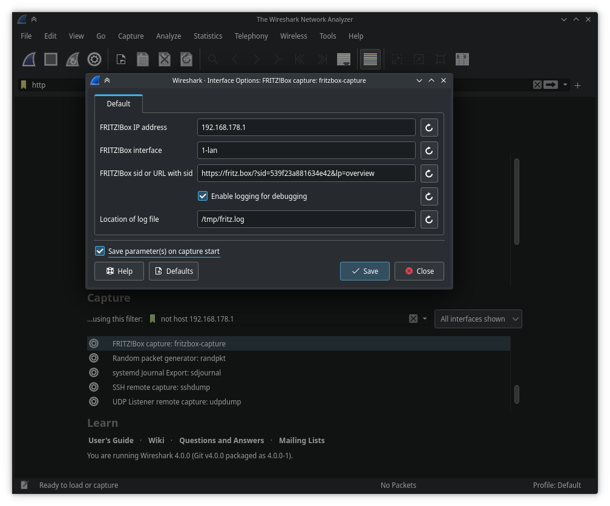

# Fritzbox external capture interface for Wireshark

Wireshark extcap plugin to capture network traffic from FRITZ!Box routers.

The `fritzbox-capture.sh` script provided here relies on the hidden packet
capturing functionality built into FRITZ!Box routers, and requires admin
credentials of the Fritzbox. To protect your admin credentials, the plugin
does not ask for your password, but the temporary session id from Fritzbox.


## Installation

Drop a copy of `fritzbox-capture.sh` in `~/.wireshark/extcap/`.
Or clone this repository and create a symlink to the file:

```sh
git clone https://github.com/Rob--W/fritzbox-extcap-wireshark
cd fritzbox-extcap-wireshark
ln -s "$PWD/fritzbox-capture.sh" ~/.wireshark/extcap/fritzbox-capture.sh
```

To detect this new script, press F5. Or quit and start Wireshark.


## Usage

1. Open Wireshark, and in the Interfaces section, find the "FRITZ!Box Capture: fritzbox-capture" option.
2. Press on the Settings button before that. You need to provide the following inputs:

   - **FRITZ!Box IP address**: The IP address of your Fritzbox router.
   - **FRITZ!Box interface**: The network interface of the router to capture from.
     Here are some examples from FRITZ!Box 7530:

     | FRITZ!Box interface | description |
     | - | - |
     | 1-lan | LAN |
     | 1-eth0 | Physical LAN1 port |
     | 1-eth1 | Physical LAN2 port |
     | 1-eth2 | Physical LAN3 port |
     | 1-eth3 | Physical LAN4 port |
     | 2-1 | Internet connection |

     To find more specific interfaces, visit https://fritz.box/?lp=cap
     For a public list from an unrelated third party, see https://github.com/jpluimers/fritzcap/blob/master/fritzcap-interfaces-table.md

   - **FRITZ!Box sid or URL with sid**: Log in to your fritzbox and copy any
     of the links containing "sid=", for example one of the sidebar links.

     When the session expires, you need to log in and provide this information
     again. The sid is asked instead of the admin password, to prevent you from
     accidentally saving your router's admin password in Wireshark.

   - There is an optional checkbox to enable logging for debugging.

3. Optionally, specify a capture filer to only select specific packets. For
   example, `host 192.168.178.2` to see all traffic going to that host. Filter
   syntax is documented at https://www.tcpdump.org/manpages/pcap-filter.7.html

4. Press Start in the dialog, or save the changes and double-click on the
   "FRITZ!Box Capture: fritzbox-capture" in Wireshark's Interfaces section to
   start capturing.


## Screenshot

